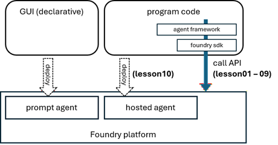

# Microsoft Agent Framework with Foundry - workshop (Python)

This repository provides end-to-end tutorials for Microsoft Agent Framework (MAF) running on Microsoft Foundry (Foundry v2).<br>
More advanced topics - such as, multi-agent design patterns, custom objects, etc - are out of scope in this repository. (This repository is for beginners.)

1. [Getting started](./01_get_started.ipynb)
2. [Trace Agent](./02_trace.ipynb)
3. [Session (Conversation Thread)](./03_session.ipynb)
4. [Tools](./04_tools.ipynb)
5. [Knowledge (Foundry IQ)](./05_knowledge.ipynb)
6. [Memory and personalization](./06_memory.ipynb)
7. [Agent Skills](./07_skills.ipynb)
8. [Harness Agent in MAF](./08_harness_agent.ipynb)
9. [Workflows](./09_workflow.ipynb)
10. [Human-in-the-loop (HITL)](./10_human_in_the_loop.ipynb)
11. [Hosted Agents in Microsoft Foundry](./11_hosted_agents.ipynb)

Microsoft Agent Framework (MAF) is a library to help you build your own custom agents, in which you can use high-level functionalities that are independent of backend clients - such as, Anthropic Claude, OpenAI, Microsoft Foundry, GitHub Copilot SDK, ...<br>
This repository assumes that Microsoft Agent Framework (MAF) runs on Microsoft Foundry client (which invokes Foundry SDK internally), but what you'll learn here can be directly applied to other clients as well.



> Note : For running Microsoft Agent Framework on Foundry Local client, please see [here](https://github.com/tsmatsuz/foundry-local-workshop/blob/master/03_agent_framework.ipynb).

## Prerequisites

Prepare (create) Microsoft Azure subscription.

Create a new Microsoft Foundry resource in [Azure Portal](https://portal.azure.com/).  
You will find that this operation creates 2 resources in Microsoft Azure - Foundry resource (parent resource) and Foundry project resource.

Next, go to Microsoft Foundry Portal for Foundry project you have just created.  
In this workshop, we need new Foundry v2 project, not v1 project. So enable **"New Foundry"** (change the toggle for "New Foundry") in Foundry Portal.

In Foundry Portal (new portal), deploy Azure OpenAI model which is supported in Azure OpenAI Responses API. (See [here](https://learn.microsoft.com/en-us/azure/ai-foundry/openai/how-to/responses?view=foundry&tabs=python-key#model-support) for the supported models.)

Install the required Python modules as follows.

```
# required in all exercises
pip install agent-framework
# required in lesson 2
pip install azure-monitor-opentelemetry
```

> Note : With ```agent-framework``` installation, the required sub-packages in Microsoft Agent Framework are all installed together. See [here](https://github.com/microsoft/agent-framework/tree/main/python/packages) for the list of sub-packages.

Throughout this workshop, we'll use Azure CLI credential.  
For this reason, install Azure CLI (```az``` command), and login to Azure by running ```az login``` command.

```
az login
```

> Note : You cannot use API key in new ```azure-ai-projects```. (See [here](https://learn.microsoft.com/en-us/answers/questions/5587848/how-to-use-api-key-in-azure-ai-foundry).) Use Entra ID users (or service principal) for credentials in Microsoft Foundry.

Clone this repository in your working environment as follows.

```
git clone https://github.com/tsmatsuz/agent-framework-workshop-with-foundry
cd agent-framework-workshop-with-foundry
```

Copy ```.env.example``` as ```.env```, open ```.env``` in editor, and set variables according to your environment.  
The variable ```FOUNDRY_PROJECT_ENDPOINT``` is the project endpoint (which has the format - "```https://[FOUNDRY-RESOURCE-NAME].services.ai.azure.com/api/projects/[PROJECT-NAME]```") and you can retrieve this endpoint from home in Microsoft Foundry Portal (new portal).  
For ```FOUNDRY_MODEL```, please set the deployment name of the model you have just deployed above.

Run notebooks.

> Note : In each exercise, we might need other preparations and settings, but these additional settings are written in each exercise.  
> (Especially, in Lesson 11, we also need ```azd``` CLI command installation. See [Lesson11](./11_hosted_agents.ipynb) for details.)

## General notes

**Package version**

All source code in this repository is experimented by using Microsoft Agent Framework version ```1.10.0```.  
If it doesn't work in the latest version, please install the specific version as follows.  

```pip install agent-framework-foundry==1.10.0 agent-framework==1.10.0 agent-framework-core==1.10.0```

**For production**

In order to keep the source code simple, the source code is mostly written in synchronous pattern. For production use, change source code with asyncio and async methods as possible to save thread pool consumption.

**Official samples**

The purpose of this repository is to provide step-by-step learning with clear explanation (background) for beginners.  
In [official GitHub samples](https://github.com/microsoft/agent-framework/tree/main/python/samples), you can see and learn more advanced code samples corresponding to a wide variety of scenarios.

*Tsuyoshi Matsuzaki @ Microsoft Asia*
